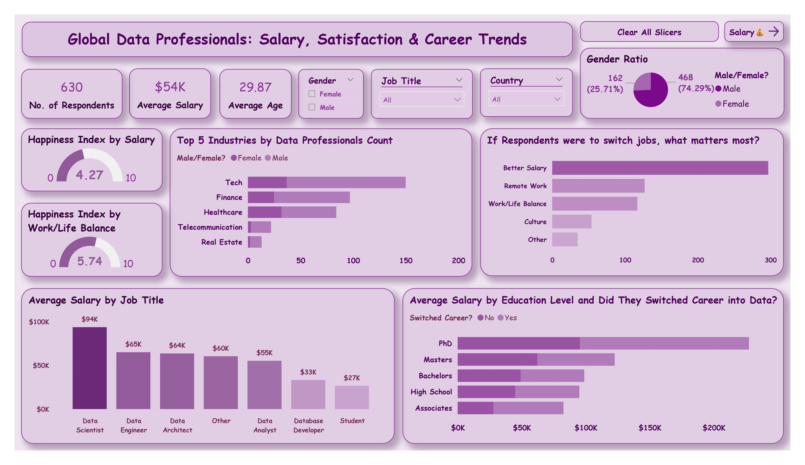
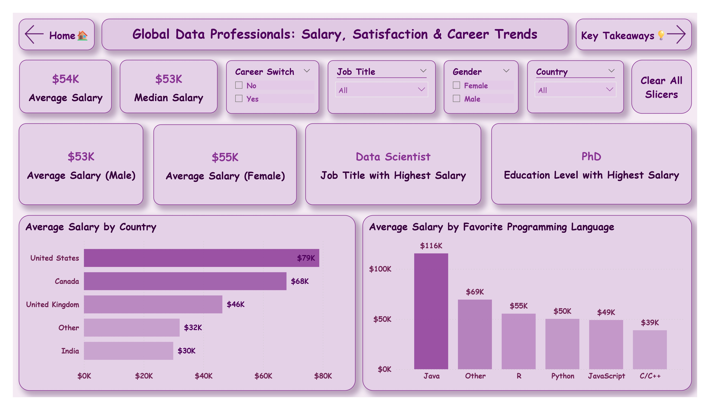

# 💼 Global Data Professionals – Salary, Satisfaction & Career Trends

A Power BI dashboard exploring real-world survey data from 600+ global data professionals to uncover actionable insights on **compensation**, **career movement**, **job satisfaction**, and **workplace priorities**.

---

## 📊 Project Overview

This project analyzes a global dataset shared by [AlexTheAnalyst](https://github.com/AlexTheAnalyst), focusing on trends across roles, education, gender, geography, and career pathways.

The dashboard is designed for **business leaders, HR teams, and workforce strategists** who want to understand:
- What roles and skills yield the highest compensation?
- How do career switchers fare in the industry?
- What drives job satisfaction and career moves?
- Are gender gaps present — and where?
- How do education levels impact earnings?

---

## 💡 Key Insights

- 💼 **Data Scientists** earn the most, averaging **$94K globally**  
- 🎓 **PhD holders** command the highest median salaries — up to **$147K**  
- 👩‍💻 **Female professionals** earn slightly more on average, despite being underrepresented  
- 🔄 **Career switchers** earn comparably to direct entrants — especially with higher education  
- 🧘‍♂️ **Remote work, salary**, and **work-life balance** top job-change motivators  
- ❗**High income doesn’t guarantee satisfaction** — salary satisfaction remains modest even in higher-paying roles

---

## 🎯 Strategic Takeaways

- 📍 Organizations should invest in **non-monetary benefits** (remote, balance, culture) to retain top talent  
- 📈 Career support for **switchers** is essential, as they show high mobility and potential  
- 🟰 Gender parity isn’t just possible — it’s **already present** in compensation (in this sample)  
- 🎓 **Education** plays a strong role in shaping salary expectations and satisfaction

---

## 🛠 Tools & Skills Demonstrated

| Category         | Skills / Features Used                                   |
|------------------|----------------------------------------------------------|
| **Power BI**     | Page navigation, drill-through, slicers, tooltip insights |
| **DAX**          | Custom salary buckets, gap % calculations, switcher flags |
| **Power Query**  | Data cleansing, value mapping, field normalization       |
| **UX Design**    | Executive layout, slicer flow, consistent design language |
| **Data Analysis**| Salary segmentation, gender ratio trends, education benchmarking |

---

## 📂 Project Structure

```
Global Data Professionals/
├── Global Data Professionals.pbix # Power BI dashboard file
├── Global Data Professionals.pdf # Exported static report
├── Raw_Data.xlsx # Source dataset
├── Screenshots/ # Dashboard previews
│ ├── Cover.jpg
│ ├── Home.jpg
│ ├── Salary.jpg
│ └── Insights.jpg
└── README.md # This file
```

---

## 📸 Dashboard Preview

### 🏠 Home Page  


### 💰 Salary Trends – Role, Gender, Education  


### 🧠 Key Insights & Takeaways  


---

## 🔗 Dataset Attribution

- **Source:** [AlexTheAnalyst – LinkedIn Survey](https://github.com/AlexTheAnalyst)  
- **Sample Size:** 630+ global data professionals  
- **Fields:** Job role, education, gender, compensation, satisfaction, job preferences  
- **License:** Public / Creative Commons

---

## 👨‍💼 About Me

Hi, I’m **Pratiyush Kumar** — a data analyst and Power BI consultant passionate about creating insight-driven dashboards with real-world business value.

📌 Transitioned from software development into analytics  
📊 Skilled in Power BI, DAX, Power Query, SQL, Excel, BigQuery  
🧠 UGC NET Qualified | Completed Deloitte Analytics Simulation  

🔗 [LinkedIn](https://www.linkedin.com/in/pratiyushh)  
📬 [Email](mailto:pratiyushpk@gmail.com)

---

> 🚀 This is part of an evolving portfolio focused on real-world analytics challenges, stakeholder-ready dashboards, and data storytelling.  
> View more at: [github.com/Pratiyushhh](https://github.com/Pratiyushhh)
