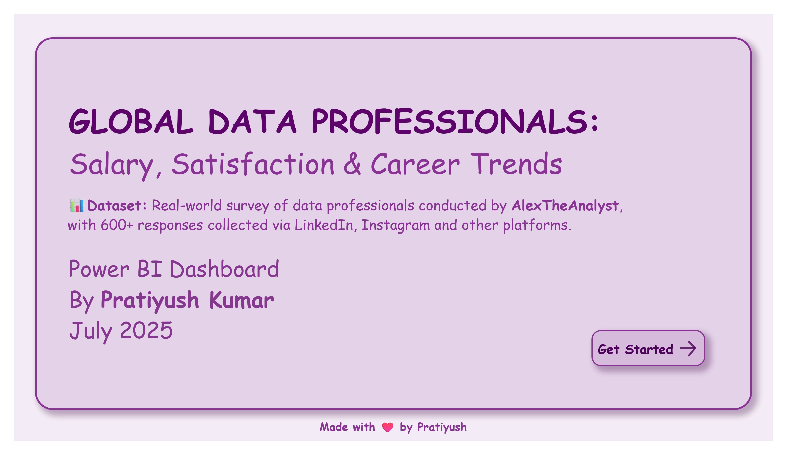

# 💼 Global Data Professionals: Salary, Satisfaction & Career Trends

A Power BI dashboard exploring real-world survey data from 600+ data professionals across the globe — designed to uncover actionable insights on compensation, career movement, job satisfaction, and workplace priorities.

---

## 📊 Overview

This project analyzes key workforce trends among global data professionals using a publicly sourced dataset from [AlexTheAnalyst](https://github.com/AlexTheAnalyst).  
It combines interactive storytelling and DAX-driven metrics to answer questions like:

- What roles and education levels earn the highest salaries?
- How do gender and geography impact compensation?
- Are career switchers at a disadvantage?
- What do data professionals value most when switching jobs?
- Does high pay lead to high satisfaction?

---

## 📌 Key Insights

- 💼 **Data Scientists** top the salary charts, averaging **$94K** globally  
- 🎓 **PhD holders** command the highest education-based pay (~**$147K**)  
- 👩‍💻 Despite being underrepresented, **females earn slightly more** than males on average  
- 🔄 **Career switchers** earn on par with direct entrants — especially when paired with higher education  
- 🏡 **Salary, remote work**, and **work-life balance** lead job change decisions  
- 📉 **High compensation ≠ high satisfaction** — salary happiness remains modest even in high-income roles  

---

## 🧰 Tools & Skills Demonstrated

| Category         | Skills / Features Used                                 |
|------------------|--------------------------------------------------------|
| **Power BI**     | Slicers, page navigation, KPI cards, tooltip insights  |
| **DAX**          | Custom measures: salary gap %, gender ratio, top N     |
| **Power Query**  | Text normalization, value mapping, column cleanup      |
| **UX Design**    | Clear page layout, drill-down logic, navigation button |
| **Data Analysis**| Demographic trends, correlation insights, benchmarking |

---

## 🗂 Project Structure

- `Project.pbix` → Interactive dashboard  
- `Project.pdf` → Static version for quick review  
- `Raw_Data.xlsx` → Source dataset  
- `Screenshots/` → Dashboard images for preview  
- `README.md` → This documentation  

---

## 📸 Dashboard Preview

### 🧾 Cover Page  

### 🏠 Home Page  

### 📊 Salary Analysis  

### 💡 Key Takeaways  

---

## 🧠 Project Highlights

- ✅ Insight-driven storytelling with business relevance  
- ✅ Real-world dataset with diverse demographics  
- ✅ Designed for stakeholder use: summary + detail views  
- ✅ Strong visual clarity and interactivity  

---

## 🔗 Dataset Attribution

> 📥 Dataset: Survey of 600+ data professionals conducted and shared publicly by [AlexTheAnalyst](https://github.com/AlexTheAnalyst) via LinkedIn, Instagram, and other channels.

---

## 👤 Author

**Pratiyush Kumar**  
📍 India | 🧠 UGC NET Qualified | 📊 Data Analytics | 💬 Power BI | DAX | SQL | Excel | BigQuery

🔗 [LinkedIn](https://www.linkedin.com/in/pratiyushh/)  
📧 [Email](mailto:pratiyushpk@gmail.com)

---

> ✨ This project is part of a growing Power BI portfolio focused on strategic insight and data storytelling.  
> View more at [github.com/Pratiyushhh](https://github.com/Pratiyushhh).
