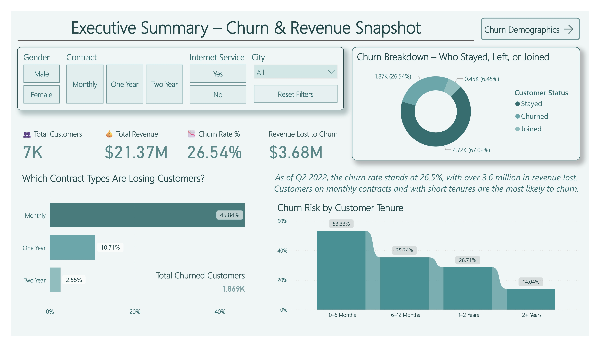

# 📉 Telecom Customer Churn Analysis – Identifying Revenue Risk & Strategic Retention Opportunities

A Power BI dashboard project analyzing customer churn behavior, revenue impact, and strategic retention opportunities for a fictional telecom company serving 7,000+ customers across California.

---

## 📊 Overview

This project explores real-world churn patterns and helps answer:

- Who is churning — and what do they look like?
- What are the top reasons for customer churn?
- Are we losing **high-value, long-tenure customers**?
- What strategies can reduce churn and protect revenue?

The dashboard delivers **data-backed insights** and **executive-level recommendations**, built for business decision-makers.

---

## 💡 Key Insights

- **$3.6M+ in revenue lost**, with 50% of it from the **top 25% of customers**
- **Short-tenure, monthly contract users** churn the most
- **Competitor-driven churn** dominates — better pricing, speed, and data
- Customers with **<3 services** or no add-ons churn more
- **Older users (50+)** and **manual payers** churn at elevated rates

---

## 📌 Recommendations

- 🎯 Target **high-value churn risks** with retention offers and loyalty programs
- 💡 Promote **value-added bundles** (Tech Support, Protection, Security)
- 📊 Reassess **fiber pricing and service quality**
- 💳 Incentivize **paperless billing** to reduce churn from manual payers
- 📢 Launch **win-back campaigns** for competitor-exit churners

---

## 🛠 Tools & Skills Demonstrated

- **Power BI** – Dashboards, slicers, navigation, tooltip cards
- **DAX** – KPI metrics, churn %, segmentation, revenue logic
- **Power Query** – Data shaping, transformation, normalization
- **Data Storytelling** – Executive summaries, insight cards, strategy framing
- **UX Design** – Page flow, iconography, interactive storytelling

---

### 📂 Project Structure

```
Telecom Customer Churn Analysis/
├── Telecom Customer Churn Analysis.pbix         # Power BI dashboard file
├── Telecom Customer Churn Analysis.pdf          # Final exported report
├── Assets/                                      # Raw data and data dictionary
│   ├── telecom_customer_churn.csv
│   ├── telecom_data_dictionary.csv
│   └── telecom_zipcode_population.csv
├── Screenshots/                                 # Page previews for GitHub display
│   ├── Cover.jpg
│   ├── Overview.jpg
│   ├── Churn Demographics.jpg
│   ├── Churn Drivers.jpg
│   ├── Revenue Risk.jpg
│   └── Key Findings.jpg
└── README.md                                     # This file
```

---

## 📦 Dataset Summary

- **Source**: [IBM Cognos Analytics](https://maven-datasets.s3.amazonaws.com/Telecom+Customer+Churn/Telecom+Customer+Churn.zip)
- **License**: Public Domain
- **Format**: CSV
- **Records**: 7,043 customers
- **Fields**: 39
- **Structure**: Multi-table (Customers, Zip Code Population, Data Dictionary)

---

## 📸 Dashboard Preview

### 🏠 Cover  


### 📊 Executive Summary – Churn & Revenue Snapshot  


### 👥 Who’s Churning? Demographic & Payment Patterns  


### ⚙️ What’s Driving Churn? Services, Internet Plans & Offers  


### 💸 High-Value Churn: Revenue Impact & Strategic Risk  


### 🧠 Key Findings & Retention Strategy  


---

## 👨‍💼 About Me

Hi, I'm **Pratiyush Kumar**, a data analyst passionate about solving real-world problems using Power BI, SQL, DAX, and data storytelling.

📎 [LinkedIn](https://www.linkedin.com/in/pratiyushh)  
📁 [GitHub Portfolio](https://github.com/Pratiyushhh/Power-BI)

---

## 📬 Feedback

Open to feedback, collaboration, and freelance/consulting opportunities.  
Feel free to connect or tag me on LinkedIn. Let’s build something impactful.

---
